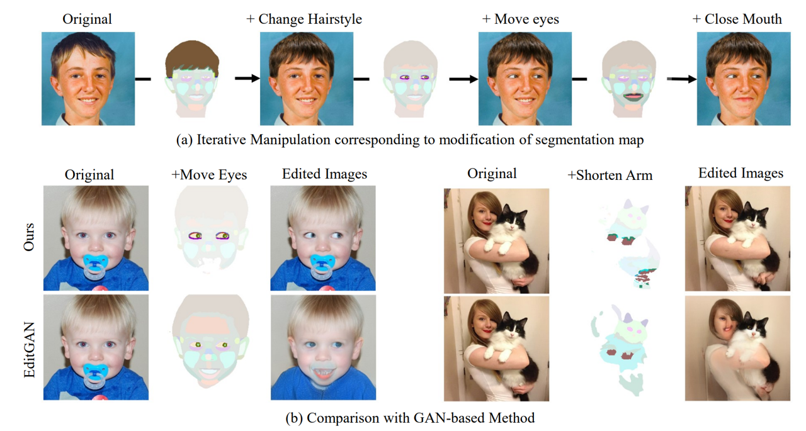

# Fine-grained Image Editing by Pixel-wise Guidance Using Diffusion Models 
[](https://arxiv.org/abs/2212.02024)  
Official implementation of the paper [Fine-grained Image Editing by Pixel-wise Guidance Using Diffusion Models](https://arxiv.org/abs/2212.02024)

This code is implemented in nnabla and pytorch.  
Please see each repository for setup and demonstration, respectively.

**NOTE**: If you want to clone a submodule as well, clone it with **--recursive**.


<p align="center">
  
</p> 


## References
```
@article{matsunaga2022fine,
  title={Fine-grained Image Editing by Pixel-wise Guidance Using Diffusion Models},
  author={Matsunaga, Naoki and Ishii, Masato and Hayakawa, Akio and Suzuki, Kenji and Narihira, Takuya},
  journal={arXiv preprint arXiv:2212.02024},
  year={2022}
}
```


