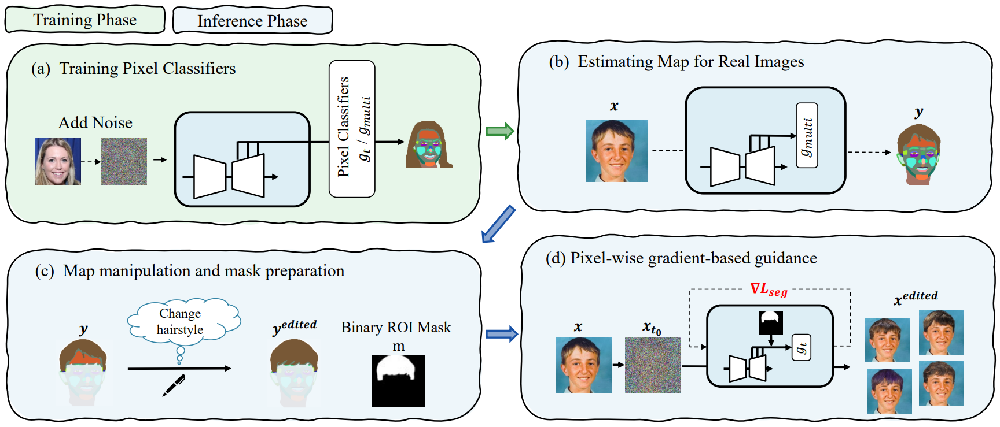

# Official nnabla implementation 
This repository is official implementation on nnabla ([Neural Network Libraries](https://github.com/sony/nnabla/)).

<p align="center">
  
</p> 


## Getting Started
### Instalation
To install dependencies, run as below:
```
# If you forget to clone nnabla-examples
git submodule update --init --recursive
```

### Environment
```
python -m venv env
source env/bin/activate
pip -r requirements.txt 

# install dependencies
cd /path/to/nnabla-examples/diffusion-models
pip install -r requirements.txt

# install NEU
cd /path/to/nnabla-examples/
pip install -e .

# install nnabla_diffusion package
cd /path/to/nnabla-examples/diffusion-models
pip install -e .
```


### Load pre-trained model
We offer pre-trained diffusion models and pixel-classifiers of FFHQ-256.
To download them, run following command,
```
scripts/download_models.sh
```

## (a) Training pixel-classifiers
### Download Dataset
To download Dataset, please follow [the official github](https://github.com/yandex-research/ddpm-segmentation#datasets) and download files.  
Then, unzip through  `tar -xzf datasets.tar.gz -C <your data dir>/datasetddpm`.

### Training
For training phase, you have to train $g_{multi}$ (inference model) and $g_t$ (guidance model) by running following command,
```
scripts/train_pixel_classifiers.sh
```


## (b),(c) Map estimation & manipulation
For manipulation of new images, please edit the target image path `datasetddpm.testing_path` in `scripts/inference.sh`, then run following command.
```
scripts/inference.sh
```

you can obtain segmentation mask $y$ (which is saved on `datasetddpm.testing_path` in default setting) of target images $x$, then modify it according to the following rules using public applications (e.g. Paint App).
- Use `.png` to maintain RGB values
- Name each files as in the [FFHQ example](../examples/nnabla) as below and put them on same directory.
  - $x$ : `imgname`_img.png
  - $y$ : `imagename`_raw.png
  - $y^{edited}$ : `imgname`_`editpart`_edited.png
- Fill in the [roi class file](../examples/nnabla/label_edit.json) with the relationship between the name of $y^{edited}$ (`imgname`_`editpart`_edited) and the class label to be edited.
  - You can confirm the correspondence between label and class index on `nnabla_diffusion/ddpm_segmentation/data_util.py`


See [`examples/nnabla`](../examples/nnabla/) for naming regulations.

## (d) pixel-wise guidance
For manipulation of new images, you should specify the target files path `seg_guide.data_dir` and roi class file path `seg_guide.roi_cls_file` in `scripts/pixel_wise_guidance.sh`, then run following command. (The quick demonstration can be run as is.)
```
scripts/pixel_wise_guidance.sh
```