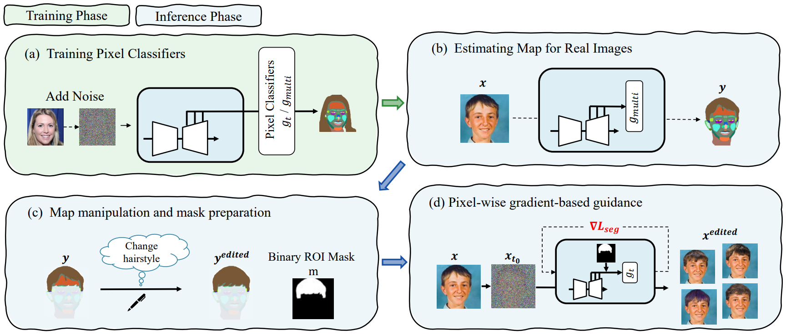

# Official pytorch implementation
This repository is official implementation on pytorch.
<p align="center">
  
</p> 

## Getting Started
### Requirements
- Python 3.8.5
- The code is tested with CUDA 11.6, cuDNN 8.3
- All results in our paper are based on NVIDIA A100 GPU 40GB

### Instalation
To install dependencies, run as below:
```
# If you forget to clone ddpm-segmentation
git submodule update --init --recursive
```

### Environment
```
python -m venv env
source env/bin/activate
pip -r requirements.txt 
```

### Load pre-trained model
We offer pre-trained diffusion models and pixel-classifiers of FFHQ-256.
To download them, run following command,
```
scripts/download_models.sh
```
For pre-trained diffusion models, we use the models published on [guided-diffusion](https://github.com/openai/guided-diffusion) and [ddpm-segmentation](https://github.com/yandex-research/ddpm-segmentation).

If you want to download models in other categories, please visit repository of [ddpm-segmentation](https://github.com/yandex-research/ddpm-segmentation).

# Instructions
If you want to do quick demonstration on [examples](../examples/torch/), you can skip to (d).
## (a) Training pixel-classifiers
For categories other than FFHQ, 
### Download Dataset
To download Dataset, please follow [the official github](https://github.com/yandex-research/ddpm-segmentation#datasets) and download files.  
Then, unzip through  `tar -xzf datasets.tar.gz -C <your data dir>/datasetddpm`.

### Training
For training phase, you have to train $g_{multi}$ (inference model) and $g_t$ (guidance model).
Run following command,
```
scripts/train_pixel_classifiers.sh
```

## (b),(c) Map estimation & manipulation
For manipulation of new images, please edit the target image path `--img_path` in `scripts/inference.sh`, then run following command.
```
scripts/inference.sh
```

you can obtain segmentation mask $y$ (which is saved on `--mask_save_path` in default setting) of target images $x$, then modify it according to following rules using public applications (e.g. Paint App).

- Use `.png` to maintain RGB values
- Name each files as in the [FFHQ example](../examples/torch) as below and put them on same directory.
  - $x$ : `imgname`_img.png
  - $y$ : `imagename`_raw.png
  - $y^{edited}$ : `imgname`_`editpart`_edited.png
- Fill in the [roi class file](../examples/torch/label_edit.json) with the relationship between the name of $y^{edited}$ (`imgname`_`editpart`_edited) and the class label to be edited.
  - You can confirm the correspondence between label and class index on `ddpm_segmentation/src/data_util.py`


See [`examples/torch`](../examples/torch/) for naming regulations.

## (d) pixel-wise guidance
For manipulation of new images, you should specify the target files path `--edit_map_path` and roi class file path `--roi_cls_file` , then run following command. (The quick demonstration can be run as is.)
```
scripts/pixel_wise_guidance.sh
```